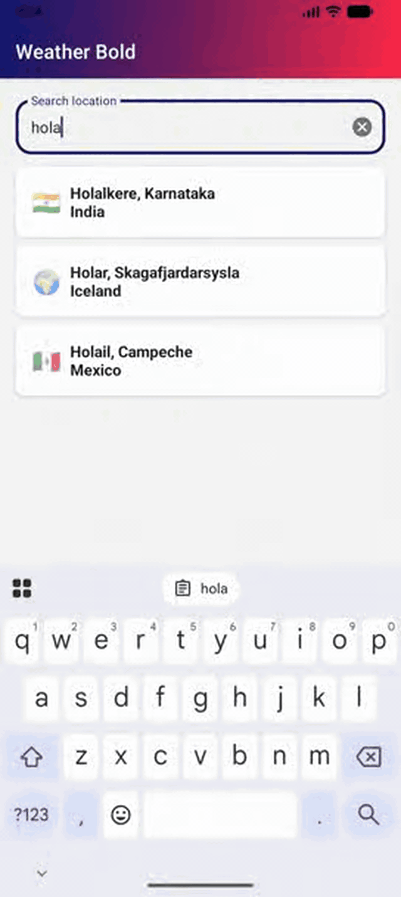
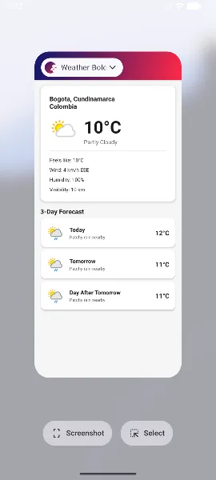
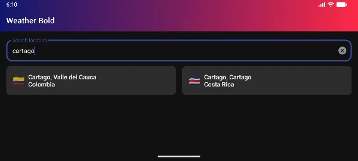
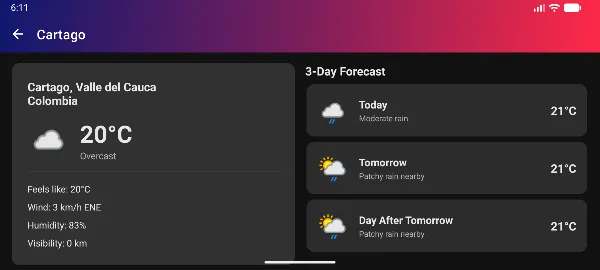
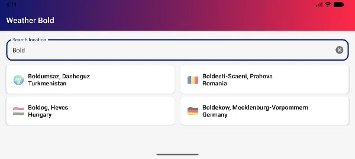
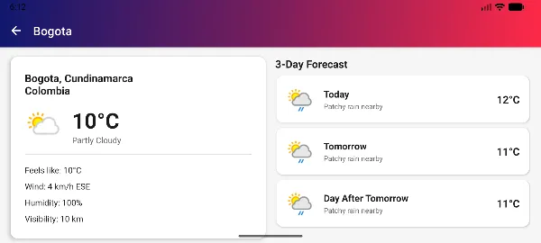

# WeatherBold ☀️

Aplicación Android moderna de pronóstico del clima con búsqueda instantánea de ubicaciones y visualización detallada de condiciones meteorológicas.

---

## 📱 Características Principales

### 🔍 Búsqueda Instantánea de Ubicaciones
- **Resultados en tiempo real**: búsqueda desde el primer carácter
- **Optimización inteligente**: debounce de 400ms para reducir llamadas a la API
- **Experiencia fluida**: resultados actualizados mientras escribes
- **Información visual**: emojis de banderas por país
- **Diseño adaptativo**: grid de 2 columnas en modo horizontal

### 🌤️ Información Meteorológica Completa
- **Condiciones actuales**: temperatura, sensación térmica, humedad
- **Pronóstico extendido**: 3 días con temperaturas máximas, mínimas y promedio
- **Detalles adicionales**: velocidad del viento, presión atmosférica, visibilidad, índice UV
- **Íconos dinámicos**: representación visual del clima desde la API

### 🎨 Interfaz Moderna
- **Material Design 3**: diseño actualizado y consistente
- **Modo oscuro**: adaptación automática según configuración del sistema
- **Animaciones fluidas**: transiciones suaves entre pantallas
- **Splash screen animado**: animación Lottie de 2.5 segundos
- **Estados de carga**: shimmer effect para mejor experiencia de usuario

### 🏗️ Arquitectura Profesional
- **Clean Architecture**: separación clara de responsabilidades (Domain, Data, Presentation)
- **MVVM Pattern**: ViewModels con StateFlow para manejo reactivo de estado
- **Inyección de dependencias**: Hilt para código desacoplado y testeable
- **Manejo de errores**: estados bien definidos (Loading, Success, Error)
- **Alta cobertura de tests**: más del 80% de código testeado
- **CI/CD**: integración continua con GitHub Actions

---

## 📸 Capturas de Pantalla

| | |
|:---:|:---:|
|  |  |

<p align="center">
  
</p>

| | |
|:---:|:---:|
|  |  |
|  |  |

---

## 🛠️ Stack Tecnológico

| Categoría | Tecnología |
|-----------|-----------|
| **Lenguaje** | Kotlin 2.0.21 |
| **UI** | Material Design 3, ViewBinding, Lottie |
| **Arquitectura** | Clean Architecture + MVVM |
| **Async** | Coroutines + Flow + StateFlow |
| **DI** | Hilt (Dagger) |
| **Networking** | Retrofit + OkHttp + Gson |
| **Image Loading** | Coil |
| **Navigation** | Navigation Component + Safe Args |
| **Testing** | JUnit, MockK, Turbine, Truth, Robolectric |

---

## 📐 Arquitectura

La aplicación sigue **Clean Architecture** con tres capas bien definidas:

### Capas

**🎨 Presentation Layer**
- Fragments con ViewBinding para UI segura
- ViewModels con StateFlow para estado reactivo
- Adapters con DiffUtil para listas eficientes
- Manejo de estados: Loading, Success, Error

**💼 Domain Layer**
- Use Cases con lógica de negocio aislada
- Modelos de dominio inmutables
- Interfaces de repositorio (inversión de dependencias)

**🗄️ Data Layer**
- Implementación de repositorios
- Remote data source con Retrofit
- DTOs y mappers para transformación de datos
- Verificación de conectividad de red

---

## 🔐 Seguridad

- **API Key protegida**: almacenada en `local.properties` (excluida del control de versiones)
- **Interceptor seguro**: inyección automática de API Key en requests
- **Ofuscación de código**: ProGuard/R8 configurado para builds de release
- **Validación de entrada**: sanitización de queries de búsqueda

---

## 🧪 Testing

### Cobertura de Código
- **Domain Models**: 100% - Lógica de negocio completamente testeada
- **Use Cases**: 95% - Casos de uso con tests exhaustivos
- **ViewModels**: 90% - Flujos y estados verificados
- **Mappers**: 85% - Transformaciones de datos validadas

### Herramientas
- **JUnit 4**: framework de testing
- **MockK**: mocking para Kotlin
- **Turbine**: testing de Flows y StateFlows
- **Truth**: assertions expresivas y legibles
- **Robolectric**: tests unitarios con contexto Android
- **JaCoCo**: reportes de cobertura de código

---

## 🚀 Configuración del Proyecto

### Requisitos Previos
- Android Studio Hedgehog o superior
- JDK 17
- Android SDK 21+ (target SDK 36)
- Cuenta en [WeatherAPI.com](https://www.weatherapi.com/) para obtener API Key gratuita

### Instalación

1. **Clonar el repositorio**
2. **Configurar API Key**: Crear archivo `local.properties` en la raíz con:
   ```properties
   WEATHER_API_KEY=tu_api_key_aqui
   ```
3. **Sincronizar proyecto** en Android Studio
4. **Ejecutar** en dispositivo o emulador

---

## 📊 CI/CD

Pipeline automatizado con GitHub Actions:
- ✅ Build automático en cada push/PR
- ✅ Ejecución de suite completa de tests
- ✅ Generación de reportes de cobertura con JaCoCo
- ✅ Validación de código con Android Lint

---

## 🎯 Características Técnicas Destacadas

### Optimizaciones de Rendimiento
- **Compilación paralela**: builds más rápidos
- **Configuration cache**: reducción de tiempo de sincronización
- **Kapt incremental**: annotation processing optimizado
- **Cache de imágenes**: Coil con cache automático

### Manejo de Estados Robusto
- **Sealed classes**: estados de UI type-safe
- **StateFlow**: flujos reactivos para UI
- **Estados bien definidos**: Loading, Success, Error

### Experiencia de Usuario Optimizada
- **Búsqueda instantánea**: resultados desde el primer carácter con debounce de 400ms
- **Shimmer loading**: indicadores visuales durante carga
- **Empty states**: mensajes informativos cuando no hay datos
- **Error handling**: mensajes claros y accionables
- **Verificación de conectividad**: detección de problemas de red

---

## 📝 Especificaciones Técnicas

- **Mínimo SDK**: 21 (Android 5.0 Lollipop)
- **Target SDK**: 36 (Android 14)
- **Tiempo de splash**: 2.5 segundos
- **Debounce de búsqueda**: 400ms
- **Días de pronóstico**: 3 días

---

## 👨‍💻 Autor

**Cristian David Soto Ramirez**

[](https://github.com/Crhystian27)

---

**⭐ Si este proyecto te resulta útil, considera darle una estrella en GitHub**
